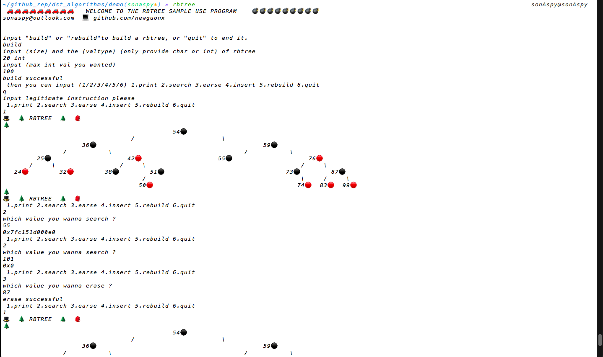
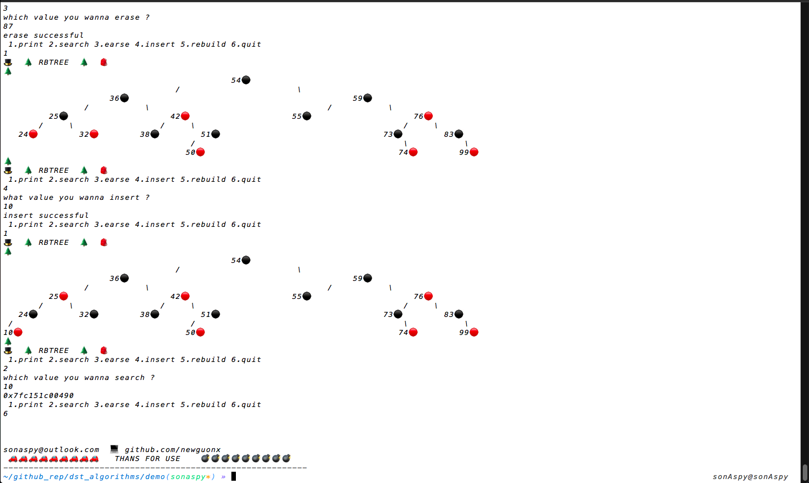
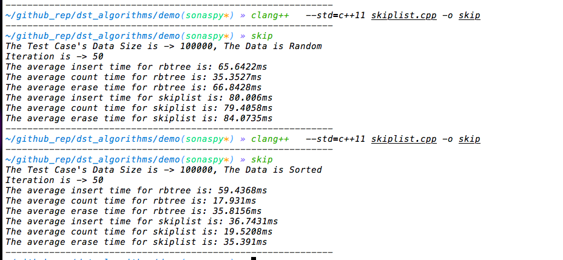

# Data Structure and Algorithms (STL style)

## Overall
./src is the  source code of my dst implementation, which is based on stl.

(detailed and efficient, actually more efficient than llvm-stl in osx).

filename start with prefix 'dst_' is the detailed implementation, otherwise is head file.

Usage: almost the same interface like stl.

```
#include "stddsa.h"
using namespace dsa;
```
./v1 is a simple and incomplete version of dst, its main purpose is for visualization.


## Example
### visualization


### performance comparsion

## huffman
```
The Total optimal WPL is -> 230
t
freq is -> 9
code is -> " 111 "
e
freq is -> 6
code is -> " 010 "
o
freq is -> 5
code is -> " 000 "
a
freq is -> 4
code is -> " 1000 "
i
freq is -> 3
code is -> " 0011 "
n
freq is -> 3
code is -> " 0110 "
r
freq is -> 3
code is -> " 0111 "
m
freq is -> 2
code is -> " 10010 "
l
freq is -> 2
code is -> " 11011 "
f
freq is -> 2
code is -> " 11000 "
x
freq is -> 2
code is -> " 10100 "
u
freq is -> 2
code is -> " 0010 "
d
freq is -> 2
code is -> " 10110 "
F
freq is -> 1
code is -> " 101011 "
#
freq is -> 1
code is -> " 101110 "
L
freq is -> 1
code is -> " 101111 "
A
freq is -> 1
code is -> " 100111 "
=
freq is -> 1
code is -> " 110010 "
p
freq is -> 1
code is -> " 110011 "
c
freq is -> 1
code is -> " 110100 "
s
freq is -> 1
code is -> " 110101 "
*
freq is -> 1
code is -> " 100110 "
z
freq is -> 1
code is -> " 101010 "
🌲  HUFFMAN TREE  🌲
                                                               �                                                                 
                                               /                               \                                                 
                               �                                                               �                                 
                       /               \                                               /               \                         
               �                               �                               �                               �                 
           /       \                       /       \                       /       \                       /       \             
       o               �               e               �               �               �               �               t         
                     /   \                           /   \           /   \           /   \           /   \                       
                   u       i                       n       r       a       �       �       �       �       �                     
                                                                          / \     / \     / \     / \     / \                    
                                                                         m   �   x   �   d   �   f   �   �   l                   
                                                                            / \     / \     / \     / \ / \                      
                                                                            * A     z F     # L     = p c s                      
🌲  HUFFMAN TREE  🌲


```
This reporsitoriy including but not limited to the following structure

- list
- slist
- deque
- vector
- greedy
- spanning tree
- divide and rule
- sorting
- heap
- graph
- balancedTree
- binaryTree
- searchTree
- queue
- stack
- rbtree
- hashtable
- btree
- ...


# src
```
// Base class that encapsulates details of allocators.  Three cases:
// an ordinary standard-conforming allocator, a standard-conforming
// allocator with no non-static data, and an stl-style allocator.
// This complexity is necessary only because we're worrying about backward
// compatibility and because we want to avoid wasting storage on an
// allocator instance if it isn't necessary.

template <class _Tp, class _Ref, class _Ptr>
struct _slist_iterator : public _slist_iterator_base
{
    typedef _slist_iterator<_Tp, _Tp &, _Tp *> iterator;
    typedef _slist_iterator<_Tp, const _Tp &, const _Tp *> const_iterator;
    typedef _slist_iterator<_Tp, _Ref, _Ptr> _Self;

    typedef _Tp value_type;
    typedef _Ptr pointer;
    typedef _Ref reference;
    typedef _slist_node<_Tp> __node;

    _slist_iterator(__node *__x) : _slist_iterator_base(__x) {}
    _slist_iterator() {}
    _slist_iterator(const iterator &__x) : _slist_iterator_base(__x.__m_node) {}

    reference operator*() const { return ((__node *)__m_node)->__m_data; }

#ifndef ___DST_NO_ARROW_OPERATOR
    pointer operator->() const
    {
        return &(operator*());
    }
#endif /* ___DST_NO_ARROW_OPERATOR */

    _Self &operator++()
    {
        this->__m_incr();
        return *this;
    }
    _Self operator++(int)
    {
        _Self __tmp = *this;
        this->__m_incr();
        return __tmp;
    }
    _Self &operator--()
    {
        this->__m_decr();
        return *this;
    }
    _Self operator--(int)
    {
        _Self __tmp = *this;
        this->__m_decr();
        return __tmp;
    }
};
```

# V1
```
C++ head file like this one
===========================
// abstract class dictionary
// abstract data type specification for dictionary data structure
// all methods are pure virtual functions
// K is key type and E is value type

#ifndef dictionary_
#define dictionary_

using namespace std;

template <class K, class E>
class dictionary
{
public:
  virtual ~dictionary() {}
  virtual bool empty() const = 0;
  // return true iff dictionary is empty
  virtual int size() const = 0;
  // return number of pairs in dictionary
  virtual pair<const K, E> *find(const K &) const = 0;
  // return pointer to matching pair
  virtual void erase(const K &) = 0;
  // remove matching pair
  virtual void insert(const pair<const K, E> &) = 0;
  // insert a (key, value) pair into the dictionary
};

#endif


```


@NewGuo,2018

